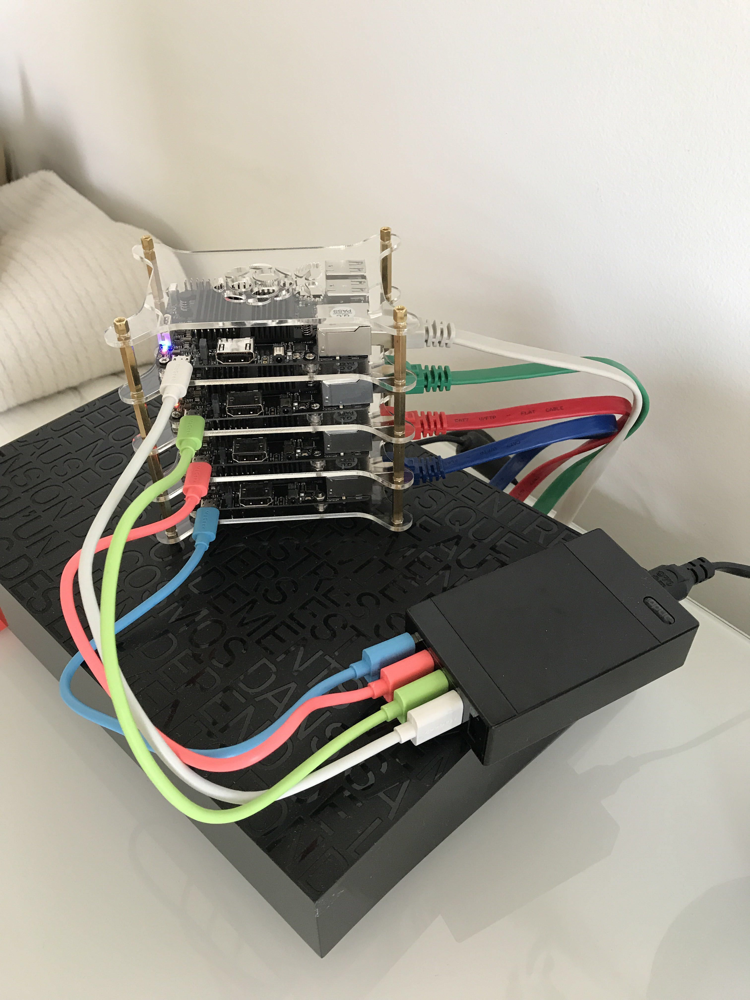

# odrokube



This project hosts the code used to create my fancy odroid cluster running k3s.
The boards are running [Armbian Bionic 4.19](https://www.armbian.com/odroid-c2/)

## Ansible inventory

In my setup, I configured my DHCP to assign static addresses for each boards
allowing to create the ansible inventory `ansible/inv.ini`:

```
[odroid]
odroid-01 ansible_host=192.168.0.30
odroid-02 ansible_host=192.168.0.31
odroid-03 ansible_host=192.168.0.32
odroid-04 ansible_host=192.168.0.33

[kube-masters]
odroid-02

[kube-workers]
odroid-01
odroid-03
odroid-04
```

The `kube-masters` defines the boards where k3s will be configured to act as a `master` nodes.
The `kube-wokers` defines the boards where k3s will be configured to act as a `worker` nodes.

## Initialize the boards

Root login is enabled by default on Armbian so the first execution will have to be
run with the `root` user, default password is `1234`.

```
$ ansible-playbook -i ansible/inv.ini ansible/init-odroid.yml -u root --ask-pass
```

After the first execution, the `ansible` user can be used with ssh key authentication:

```
$ ansible-playbook -i ansible/inv.ini ansible/init-odroid.yml -u ansible
```

## Accessing cluster from outside

Copy /etc/rancher/k3s/k3s.yaml on your machine located outside the cluster as ~/.kube/config.
Then replace "localhost" with the IP or name of your k3s server. kubectl can now manage your k3s cluster.
